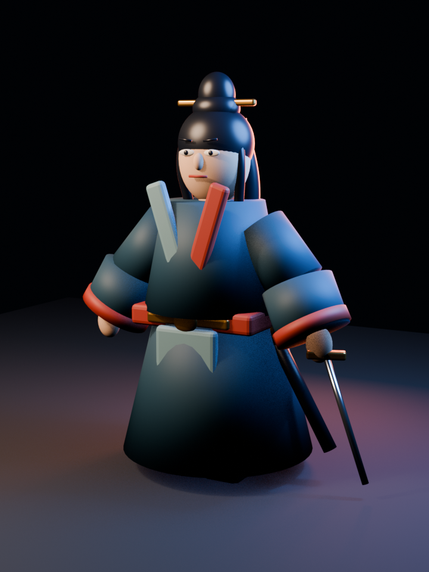
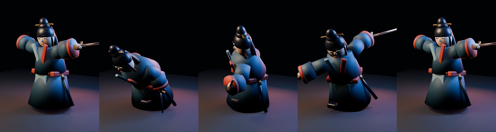
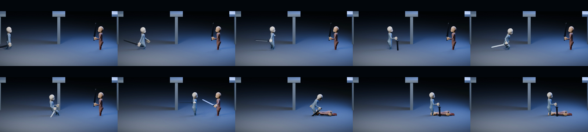

# 墨刃 Motion Lab

AI 驱动骨骼角色完成连续表演的动态漫纵向切片。当前版本已经停止使用静态 PNG 角色横移，改为真正的关节骨骼、Root Motion、武器挂点、双人反应和动作约束时间线。

## 当前闭环

1. 输入中文导演指令。
2. Director Adapter 将动作语义编译成结构化 Motion Plan。
3. 两名 18 骨骼关节角色连续执行走入、环顾、说话、拔刀、闪避、交锋、受击和恢复。
4. 执行层处理 Root Motion、移动/目标朝向、脚底约束、手部武器挂点、视线和接触同步。
5. 时间线可寻址、拖动和重新执行，也可导出 MP4。

仓库同时包含一条 Blender 离线验证链路：结构化 Motion Plan 驱动一个 CC0 骨骼角色，将 `Walking`、`Roll_sword`、`Run_swordAttack`、`swordAttackJump`、`Death` 等外部制作的动作片段组合成连续表演。它用来验证真正的骨骼执行路线，不以浏览器低模动画代替最终效果。

动作底座已接入 Quaternius Universal Animation Library 1/2 的 CC0 标准版，同时保留 in-place 与 root-motion 数据。动作元数据不靠人工抄表，而是由 Blender 扫描原始 GLB 自动生成可检索目录；这些素材只负责动作能力，不决定最终人物画风。

本地语义适配器是无模型依赖的可测 fallback，不冒充最终 AI。`MotionPlan` 是模型与执行器之间的稳定契约，后续可接任意 LLM Director；最终生产渲染层计划迁移到 Unreal Engine 或 Blender。

## 运行

```bash
npm install
npm run dev
```

打开 `http://127.0.0.1:4173`。

### Blender 骨骼动作验证

需要 Blender 5.2 LTS：

```bash
./scripts/render_blender_validation.sh stills
./scripts/render_blender_validation.sh video
```

脚本读取 `blender/motion-plan.validation.json`，输出 `.blend`、关键帧图片或 MP4 到 `exports/blender-validation/`。动作计划只描述动作片段、目标时段、Root Motion 和朝向，执行器负责骨骼动作、过渡和武器挂接。

### 动作库目录

```bash
./scripts/build_motion_catalog.sh
python3 scripts/search_motion_library.py "转身闪避"
python3 scripts/search_motion_library.py "持剑攻击"
```

目录位于 `blender/motion-library.catalog.json`，包含动作名、分类、时长、骨架、文件校验和与 root-motion 标记。`blender/motion-bindings.json` 将验收动作语义绑定到候选片段；Director 生成的每个节拍已携带这些候选，而不是只输出无法执行的标签。

### 跨骨架重定向

```bash
./scripts/retarget_motion.sh Sword_Regular_Combo
```

该命令把 UAL 动作通过外置骨骼映射重定向到另一套角色骨架，输出可继续编辑的 `.blend`、检查报告和五张采样帧。更换正式角色时只需新增对应 rig map，不改 Director 的动作语义。

### Blender MCP 建模实验

本机已接入 Blender Lab 官方实验版 MCP。`blender/build_wuxia_character_prototype.py` 通过 MCP 在当前 Blender 会话中生成古风角色，并加入与 UAL 对齐的 21 根核心人形骨骼；`blender/animate_wuxia_character_prototype.py` 再通过 MCP 把 `Sword_Regular_Combo` 迁移到自建角色。

验证结果为 91 帧、30 FPS 的连续关节剑术动作：头、躯干、双臂、双腿和右手佩剑分别由骨骼驱动，不是整个人物平移。当前仍是刚性分件绑定，衣摆没有蒙皮/布料骨骼，不能代表最终角色形变质量。



[查看自建角色剑术动作视频](docs/wuxia-character-sword-combo.mp4)



[查看 10 秒验证视频](docs/blender-motion-validation.mp4)



## 验收重点

- 打开“显示骨骼”可检查角色确实由骨骼层级驱动。
- 输入不同顺序的动作描述，动作计划随语义重新编排。
- 角色动作必须连续，不能退回静态立绘横移。
- 交锋节拍同时驱动双方姿态与武器接触提示。

## 当前边界

- 浏览器角色仍是程序化低模验证资产，不代表最终美术质量；Blender 验证使用真实骨骼资产和外部动作片段。
- 当前 Director 使用本地确定性语义适配器；真实模型接入仍待实现。
- Blender 样片目前验证“计划选择并组合动作片段”，尚未完成异骨架重定向、脚底锁定、手部 IK 和精确双人接触；这些仍是进入生产级流畅度的下一关。
- Quaternius 角色/人偶仅用于动作和重定向测试，不作为武侠样片的最终人物；验收人物仍需独立确定符合中国古风审美、许可可用的高质量绑定资产。
- 浏览器运行时用于快速验证和导演台预览，不作为最终离线动画渲染器。
